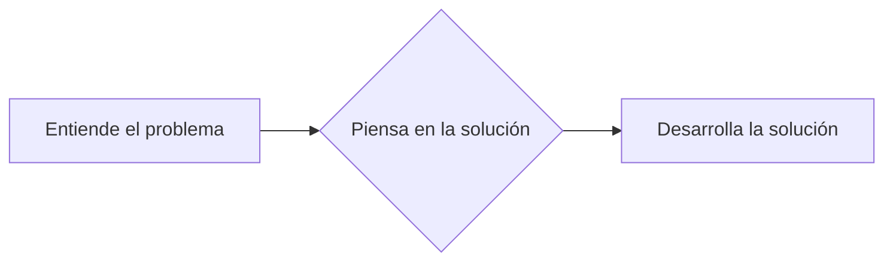

# Lenguaje de Marcas

Práctica de trabajo para la semana del 24 al 30 de Noviembre.

Recuerda que una buena documentación permite:

- Evaluar de forma clara tus conocimientos sobre la materia
- Compartir tus ideas/conocimientos con el resto de personas que accedan a tu repositorio
- Mejorar tus competencias: en algunos casos puedes descubrir nuevas/mejores formas de hacer las cosas