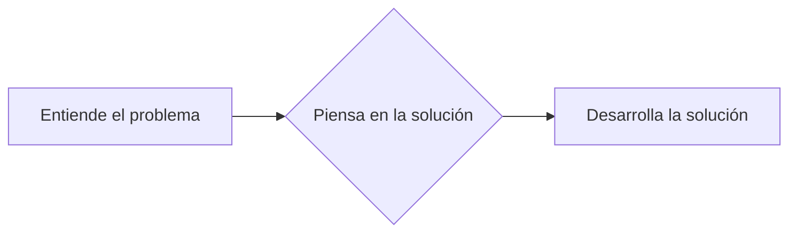

# Lenguaje de Marcas

Práctica de trabajo para la semana del 24 al 30 de Noviembre.

```mermaid
  graph LR
      accTitle: Proceso
      accDescr {
        Práctica de HTML y CSS de Lenguaje de Marcas
         }
      A[Entiende el problema] --> B{Piensa en la solución}
      B --> D[Desarrolla la solución]

```